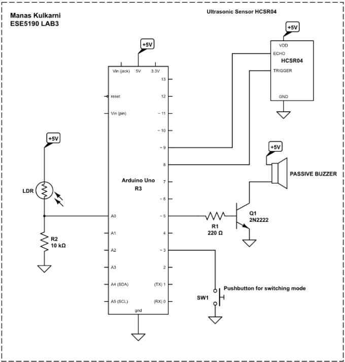

# Theremin

Initially, the different modes of operation of timers in ATmega32p are tested out to select the best mode for our application, which in this case is the musical instrument - 'Theremin'.
Here, I built Theremin using ATmega328p, HCSR04 sensor, a passive buzzer and required peripherals (pushbuttons, transistors, etc.).

